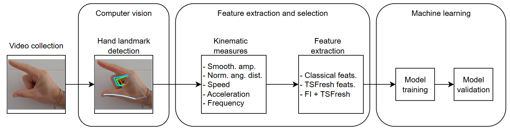

# Artificial Intelligence for Parkinson's Disease Evaluation: an experimental study on finger tapping

This repository is the official implementation of: (future link to the paper)



## Requirements

In this project you can find two different files for recreating the conda environment:

a) To install only packages, run:

```setup
conda create --name new_env --file requirements.txt
```

b) To import full environment, run:

```setup
conda env create -f environment.yml
```

## Steps 

```notebooks\Main.ipynb``` provides step-by-step instructions for processing data.

a) First of all, you have to add your UPDRS ratings file to ```input_files``` folder. Name of this file must be ```<dataset_identifier>_diagnostic.csv```. This ```<dataset_identifier>``` must be the same as you will use inside main notebook ```notebooks\Main.ipynb```

This file must contain two columns, called *ID* and *UPDRS*, separated by comma "*,*".
- *ID*: name of each video file, without extension
- *UPDRS*: UPDRS rating per video
```csv  
ID,UPDRS
video1,0
video2,3
...
```


b) Please, review ```lib\config.py```. Current variables fit the folder structure that it is shown under this project.

c) Using MediaPipe, ```process_video``` function will generate the baseline kinematic measures time series. As result, these files are generated: 

- ```output_files\<dataset_identifier>_time_series.csv```: baseline kinematic measures time series.
- ```output_files\<dataset_identifier>_fps_videos.csv```: containing the fps for each video.
- ```log\<dataset_identifier>_frame_rate_processed_videos.csv```: for each successfully processed video, the percentage of frames where the hand is detected successfully is shown.
- ```log\<dataset_identifier>_frame_rate_rejected_videos.csv```: for each rejected video, the percentage of frames where the hand is detected successfully is shown. These videos are excluded for next steps.

d) Function ```extract_all_features``` extracts all the features using all approaches (Classical, TsFresh and FI+TsFresh). As output, these files are generated:

- ```output_files\<dataset_identifier>_classical_features.csv```.
- ```output_files\<dataset_identifier>_tsfresh_features.csv```.
- ```output_files\<dataset_identifier>_fi_tsfresh_features.csv```.

e) Finally, function ```classify_video``` performs machine learning models training and validation. As input, ```features_type``` value must be provided. Accepted values are: *classical*, *tsfresh* and *fi_tsfresh*. As result, these files are generated: 

- ```log\<dataset_identifier>_<features_type>_execution.csv```: tracks the progress of the execution.
- ```result_files\<dataset_identifier>_<features_type>_result.csv```: shows a detailed report for each iteration.
- ```result_files\<dataset_identifier>_<features_type>_execution_summary.csv```: this files provides a summary of each algorithm’s performance and the global outcome for each evaluated metric.
- ```result_files\confusion_matrix\<dataset_identifier>_<features_type>_cm_<ml_algorithm>.png```: final confusion matrix for each evaluated algorithm.

## References

If you use this code in your research, please cite our paper

```
Pending
```
